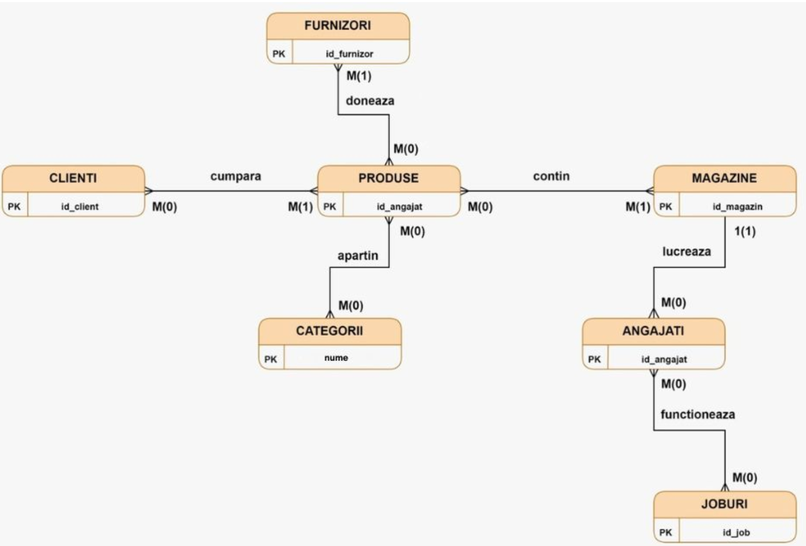
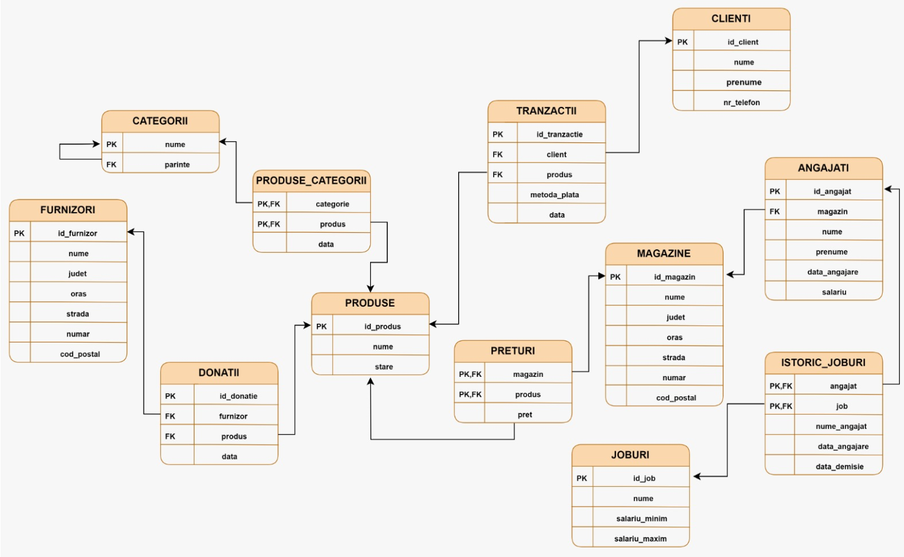

# ElectroDelicii - Second-Hand Electronics Shop Database



## Overview

ElectroDelicii is a database system designed for managing a chain of second-hand electronics shops. The system handles inventory management, sales transactions, employee records, supplier relationships, and store locations.

## Database Structure

The database consists of 12 tables with relationships designed to efficiently track all aspects of the business:

1. **PRODUSE (Products)** - Stores information about each product including name and condition
2. **MAGAZINE (Stores)** - Contains details about each store location
3. **PRETURI (Prices)** - Intermediate table linking products to stores with pricing information
4. **ANGAJATI (Employees)** - Stores employee information including salary and hire date
5. **ISTORIC_JOBURI (Job History)** - Intermediate table tracking employee job history
6. **JOBURI (Jobs)** - Contains job titles and salary ranges
7. **FURNIZORI (Suppliers)** - Stores information about product suppliers
8. **DONATII (Donations)** - Intermediate table tracking product donations from suppliers
9. **CLIENTI (Customers)** - Stores customer information
10. **TRANZACTII (Transactions)** - Intermediate table tracking product sales
11. **CATEGORII (Categories)** - Stores product categories with hierarchical relationships
12. **PRODUSE_CATEGORII (Product Categories)** - Intermediate table linking products to categories



## Business Rules

- Customers are defined as people who have purchased at least one product
- Products cannot be returned once purchased (per company policy)
- New stores begin with no employees but can add staff through interviews
- If an employee resigns, they cannot be rehired at any other ElectroDelicii store
- Employees can hold multiple positions within the company
- Most products come from suppliers and may be used or defective, with some exceptions for new items
- Categories can contain multiple subcategories forming a hierarchical structure

## Technical Implementation

### Entity Relationship Constraints

The database implements several integrity constraints:

- **Primary Keys** for unique identification of records
- **Foreign Keys** to maintain referential integrity between tables
- **NOT NULL** constraints for required fields
- **CHECK** constraints to validate data (e.g., minimum salary requirements, valid postal codes)
- **UNIQUE** constraints to prevent duplicate records
- **DEFAULT** values for common fields

### ON DELETE Behaviors

The system implements various ON DELETE behaviors for foreign keys:

- **CASCADE** - When a record is deleted, related records are also deleted (e.g., when a store is closed, all its price records are removed)
- **SET NULL** - When a record is deleted, the foreign key in related records is set to NULL

## Getting Started

1. Install Oracle Database (version 12c or higher recommended)
2. Run the SQL script file to create the database schema and tables
3. Populate initial data using the provided INSERT statements
4. Connect to the database using your preferred client application

## Query Examples

```sql
-- Find all products by category
SELECT p.nume, p.stare, c.nume AS categorie
FROM produse p
JOIN produse_categorii pc ON p.id_produs = pc.produs
JOIN categorii c ON pc.categorie = c.nume
ORDER BY c.nume;

-- List employees by store location
SELECT a.nume, a.prenume, m.nume AS magazin, m.oras
FROM angajati a
JOIN magazine m ON a.magazin = m.id_magazin
ORDER BY m.nume;

-- Calculate total sales by payment method
SELECT metoda_plata, COUNT(*) AS numar_tranzactii, SUM(pr.suma) AS valoare_totala
FROM tranzactii t
JOIN preturi pr ON t.produs = pr.produs
GROUP BY metoda_plata;
```

